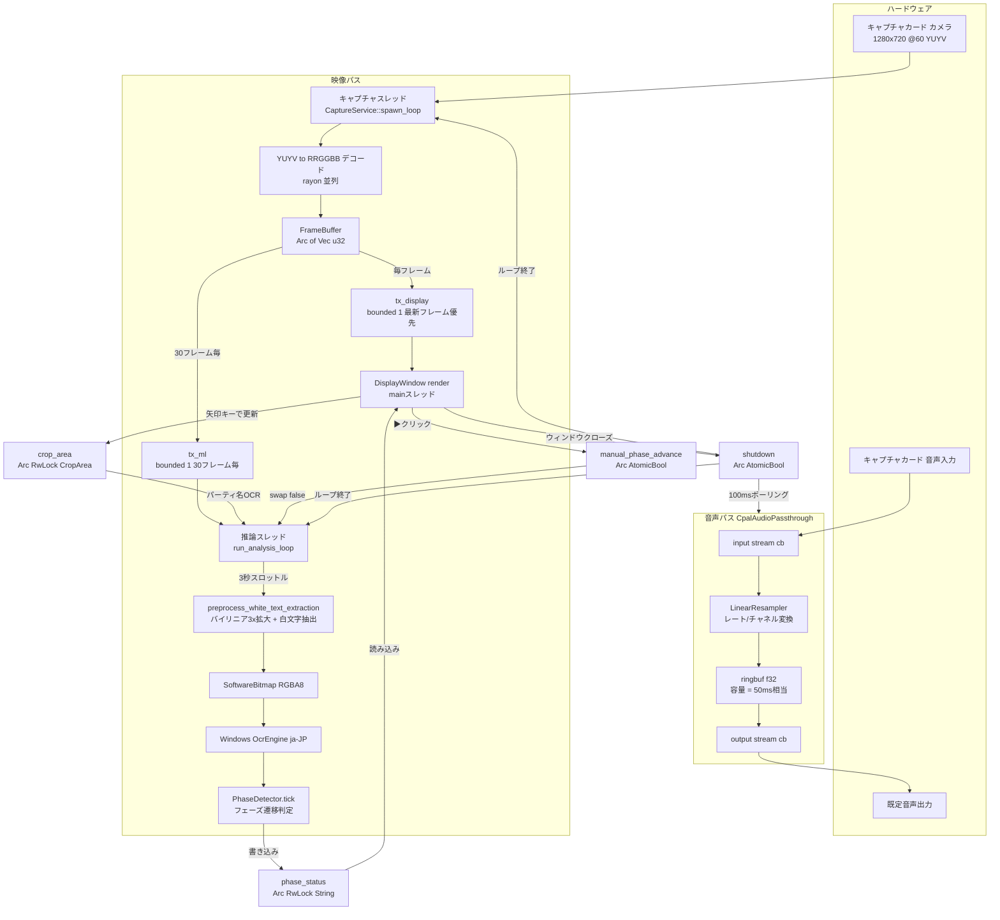
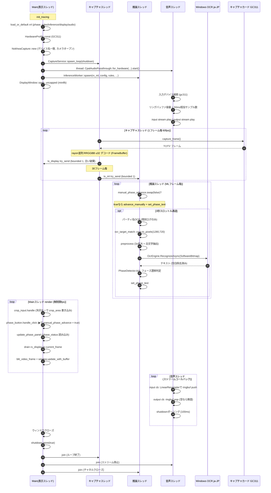
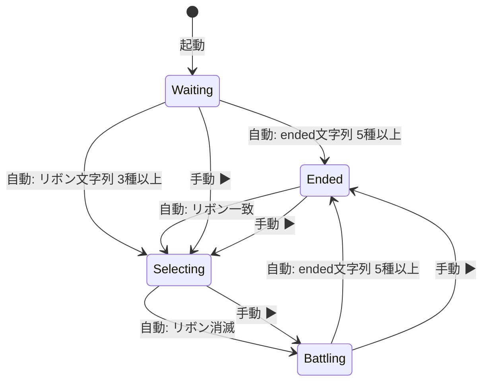

# アーキテクチャ フロー図

> 構成: main(表示) / キャプチャ / 推論 / 音声 の4スレッド。
> 映像は 1280x720@60 YUYV を nokhwa で取得し RRGGBB u32 にデコード、
> 音声は 50ms 相当のリングバッファでパススルー。

## 1. データフロー（映像・音声・共有状態）

## 2. スレッドシーケンス（起動 → 定常 → シャットダウン）

## 3. フェーズ状態遷移

> 自動判定は `PhaseDetector::detect_from_idle / detect_selecting / detect_battling`。
> 「待機」と「対戦終了」は監視上同一状態（`detect_from_idle`）だが表示・手動進行サイクルのため別状態。
> 手動進行は ▶ボタンで 選出 → バトル → 対戦終了 → 選出… を循環（待機はサイクル外）。

