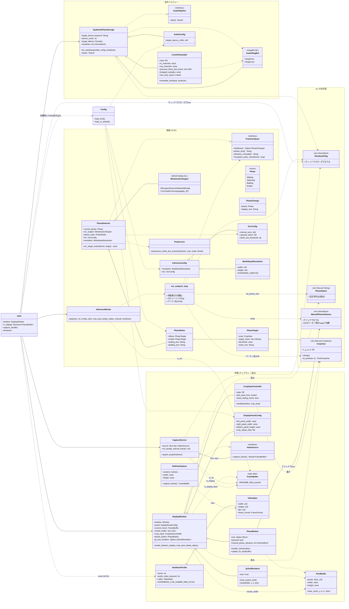

# アーキテクチャ オブジェクト図

> main(表示) / キャプチャ / 推論 / 音声が4スレッド、共有状態は Arc 経由で渡す。
>
> 記法: Mermaid の classDiagram は `<...>` が HTML と解釈されて消えるため、
> 汎用型は `Arc (AtomicBool)` のように書いている。

```mermaid
classDiagram
    direction LR

    class main {
    +window: DisplayWindow
    +rx_display: Receiver~FrameBuffer~
    +capture_handles
    +shutdown
    }

    namespace ArcSharedState ["Arc 共有状態"] {
        class ShutdownFlag {
            <<Arc AtomicBool>>
            +ウィンドウクローズで立てる
        }
        class PhaseStatus {
            <<Arc RwLock String>>
            +空文字列は非表示
        }
        class ManualPhaseAdvance {
            <<Arc AtomicBool>>
            +クリックで立てる
            +OCRワーカー側がswapで消費
        }
        class CropArea {
            <<Arc RwLock CropArea>>
            +x_y_w_h: f32
            +clamp()
            +to_pixels(w, h) PixelCropArea
        }
    }

    namespace VideoCaptureDisplay ["映像 (キャプチャ + 表示)"] {
        class DisplayWindow {
            +window: Window
            +panel: DisplayPanelConfig
            +current_frame: FrameBuffer
            +render_buffer: Vec~u32~
            +crop_input: CropInputController
            +phase_button: PhaseButton
            +jp_text_renderer: Option~JpTextRenderer~
            +render_latest(rx_display, crop_area, phase_status)
        }
        class CropInputController {
            +step: f32
            +last_input_time: Instant
            +show_debug_frame: bool
            +handle(window, crop_area)
        }
        class PhaseButton {
            +rect: Option~Rect~
            +pressed: bool
            +manual_phase_advance: Arc~AtomicBool~
            +handle_click(window)
            +update_for_text(buffer)
        }
        class JpTextRenderer {
            +font: Font
            +load_system_font()
            +draw(buffer, x, y, text)
        }
        class PixelBuffer {
            +pixels: Slice_u32
            +width: usize
            +height: usize
            +clear_rect(x, y, w, h, color)
        }
        class DisplayPanelConfig {
            +left_panel_width: usize
            +right_panel_width: usize
            +bottom_panel_height: usize
            +crop_adjust_step: f32
        }
        class CaptureService {
            +source: Box~dyn VideoSource~
            +ml_sample_interval_frames: u32
            +spawn_loop(shutdown)
        }
        class VideoSource {
            <<interface>>
            +capture_frame() Result~FrameBuffer~
        }
        class NokhwaCapture {
            +camera: Camera
            +width: usize
            +height: usize
            +capture_frame() FrameBuffer
        }
        class FrameBuffer {
            <<type alias>>
            +RRGGBB_32bit_packed
        }
        class HardwareProfile {
            +name: str
            +audio_video_keyword: str
            +video: VideoSpec
            +AVERMEDIA_LIVE_GAMER_MINI_GC311
        }
        class VideoSpec {
            +width: u32
            +height: u32
            +fps: u32
            +frame_format: FrameFormat
        }
    }

    namespace InferenceOCR ["推論 (OCR)"] {
        class InferenceWorker {
            +spawn(rx_ml, config, rules, crop_area, phase_status, manual, shutdown)
        }
        class run_analysis_loop {
            +手動進行の消費()
            +スロットリング3s()
            +パーティ名OCR()
        }
        class FrameAnalyzer {
            <<interface>>
            +tick(frame) Option~PhaseChange~
            +phase_text() String
            +advance_manually() String
            +recognize_party_name(frame, crop)
        }
        class PhaseDetector {
            +current_phase: Phase
            +ocr_engine: WindowsOcrEngine
            +phase_rules: PhaseRules
            +ocr: OcrConfig
            +resolution: ModelInputResolution
            +ocr_target_match(frame, target) usize
        }
        class WindowsOcrEngine {
            <<Win32 Media.Ocr>>
            +RecognizeAsync(SoftwareBitmap)
            +TryCreateFromLanguage(ja_JP)
        }
        class Phase {
            <<enum>>
            Waiting
            Selecting
            Battling
            Ended
        }
        class PhaseChange {
            +phase: Phase
            +display_text: String
        }
        class PhaseRules {
            +ribbon: PhaseTarget
            +ended: PhaseTarget
            +waiting_text: String
            +battling_text: String
        }
        class PhaseTarget {
            +crop: CropArea
            +target_chars: Vec~String~
            +threshold: usize
            +enter_text: String
        }
        class Preprocess {
            +preprocess_white_text_extraction(frame, crop, scale, thresh)
        }
        class InferenceConfig {
            +resolution: ModelInputResolution
            +ocr: OcrConfig
        }
        class OcrConfig {
            +interval_secs: u64
            +upscale_factor: f32
            +white_text_threshold: u8
        }
        class ModelInputResolution {
            +width: u32
            +height: u32
            +STANDARD_1280X720
        }
    }

    namespace AudioPassthrough ["音声パススルー"] {
        class CpalAudioPassthrough {
            +target_device_keyword: String
            +device_name: str
            +target_latency: Duration
            +shutdown: Arc~AtomicBool~
            +for_hardware(profile, config, shutdown)
            +start() Result
        }
        class AudioPipeline {
            <<interface>>
            +start() Result
        }
        class LinearResampler {
            +ratio: f64
            +in_channels: usize
            +out_channels: usize
            +previous_block_last_frame: Vec~f32~
            +dropped_samples: usize
            +last_drop_report: Instant
            +resample_into(input, producer)
        }
        class AudioRingBuf {
            <<HeapRb f32>>
            +HeapProd
            +HeapCons
        }
        class AudioConfig {
            +target_latency_millis: u64
        }
    }

    class Config {
        +load_toml()
        +load_or_default()
    }

    main --> DisplayWindow
    main --> CaptureService
    main --> InferenceWorker
    main --> CpalAudioPassthrough
    main ..> ShutdownFlag : ウィンドウクローズでtrue
    main ..> Config : 起動時にTOML読み込み
    main ..> HardwareProfile : const GC311

    CaptureService o-- VideoSource : Box~dyn~
    NokhwaCapture ..|> VideoSource
    NokhwaCapture ..> VideoSpec : new
    HardwareProfile o-- VideoSpec
    CaptureService ..> ShutdownFlag
    CaptureService ..> FrameBuffer : tx_display
    CaptureService ..> FrameBuffer : tx_ml

    DisplayWindow o-- CropInputController
    DisplayWindow o-- PhaseButton
    DisplayWindow o-- JpTextRenderer
    DisplayWindow o-- DisplayPanelConfig
    DisplayWindow ..> PixelBuffer : render_buffer
    DisplayWindow ..> FrameBuffer : rx_display drain
    DisplayWindow ..> CropArea : 読み
    DisplayWindow ..> PhaseStatus : 読み
    JpTextRenderer ..> PixelBuffer
    CropInputController ..> CropArea : 書き
    PhaseButton --> ManualPhaseAdvance : クリックでtrue
    PhaseButton ..> PixelBuffer

    InferenceWorker ..> run_analysis_loop
    InferenceWorker ..> FrameBuffer : rx_ml
    run_analysis_loop ..> FrameAnalyzer
    run_analysis_loop ..> PhaseStatus : set_phase_text
    run_analysis_loop ..> ManualPhaseAdvance : swap
    run_analysis_loop ..> ShutdownFlag
    run_analysis_loop ..> CropArea : パーティ名OCR
    PhaseDetector ..|> FrameAnalyzer
    PhaseDetector o-- WindowsOcrEngine
    PhaseDetector o-- PhaseRules
    PhaseDetector ..> Preprocess
    PhaseDetector ..> OcrConfig
    PhaseRules o-- PhaseTarget
    PhaseTarget o-- CropArea
    InferenceConfig o-- OcrConfig
    InferenceConfig o-- ModelInputResolution
    Config ..> PhaseRules
    Config ..> InferenceConfig
    Config ..> DisplayPanelConfig
    Config ..> AudioConfig

    CpalAudioPassthrough ..|> AudioPipeline
    CpalAudioPassthrough o-- LinearResampler
    CpalAudioPassthrough o-- AudioRingBuf
    CpalAudioPassthrough o-- AudioConfig
    LinearResampler ..> AudioRingBuf
    CpalAudioPassthrough ..> AudioRingBuf
    CpalAudioPassthrough ..> ShutdownFlag
```
